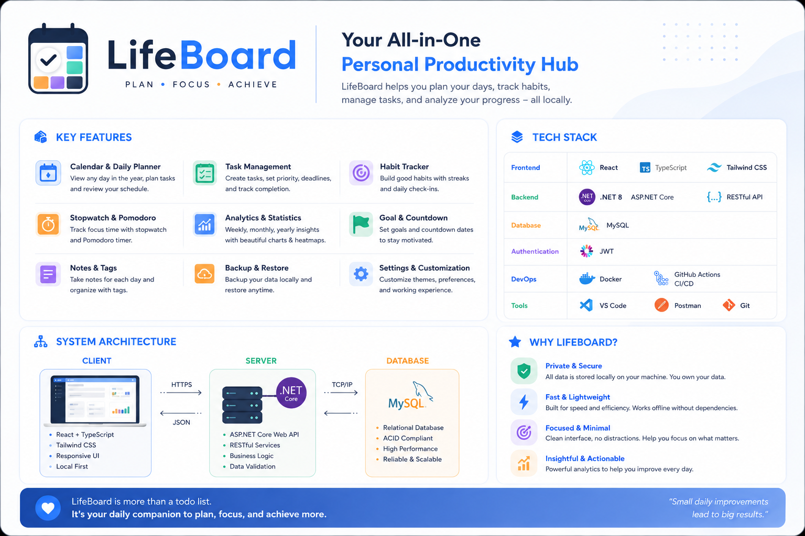

# LifeBoard — Personal Productivity System

> Local-first web app for task management, habit tracking, focus sessions & analytics.



## Tech Stack

| Layer    | Technology                  |
|----------|-----------------------------|
| Frontend | React 18 + TypeScript + Vite |
| Backend  | ASP.NET Core 9 Web API       |
| Database | MySQL 8.0                    |
| Deploy   | Docker Compose (optional)    |

## Quick Start (Manual)

### Prerequisites
- Node.js 20+, .NET 9 SDK, MySQL 8.0+

### 1. Database
```bash
mysql -u root -p < LifeBoard.API/Migrations/001_init_schema.sql
```

### 2. Backend
```bash
cd LifeBoard.API
# Edit appsettings.Development.json with your MySQL credentials
dotnet run
# API at http://localhost:5000
```

### 3. Frontend
```bash
cd lifeboard-client
# Edit .env.local if needed
npm run dev
# App at http://localhost:5173
```

## Quick Start (Docker)

```bash
docker compose up -d --build
# App at http://localhost:5173
```

## Project Structure

```
LifeBoard/
├── docs/                    # 12 documentation files
├── lifeboard-client/        # React + TypeScript frontend
│   └── src/
│       ├── components/      # Shared UI + Layout
│       ├── features/        # Feature modules (18 pages)
│       ├── lib/             # API client, queryClient, utils
│       ├── stores/          # Zustand stores (theme, settings)
│       ├── router/          # React Router config
│       ├── styles/          # CSS design system (tokens + themes)
│       └── types/           # TypeScript interfaces
├── LifeBoard.API/           # ASP.NET Core 9 backend
│   ├── Controllers/         # 13 API controllers
│   ├── Services/            # Business logic layer
│   ├── Repositories/        # Data access (Dapper + MySQL)
│   ├── Models/              # Entities + DTOs
│   ├── Infrastructure/      # DB connection factory
│   ├── Middleware/          # Error handling
│   ├── BackgroundServices/  # Daily task scheduler
│   └── Migrations/          # SQL schema scripts
└── docker-compose.yml
```

## Documentation

| File | Description |
|------|-------------|
| [01-Vision](docs/01-Vision.md) | Product vision & scope |
| [02-Product-Backlog](docs/02-Product-Backlog.md) | 21 features with user stories |
| [03-User-Flow](docs/03-User-Flow.md) | 21 user flows |
| [04-Use-Case](docs/04-Use-Case.md) | 28 use cases |
| [05-Domain-Model](docs/05-Domain-Model.md) | Domain entities & relationships |
| [06-SRS](docs/06-SRS.md) | Software Requirements Specification |
| [07-ERD-Database-Design](docs/07-ERD-Database-Design.md) | Database schema + SQL queries |
| [08-SDD](docs/08-SDD.md) | Software Design Document |
| [09-API-Specification](docs/09-API-Specification.md) | REST API reference |
| [10-UI-Guideline](docs/10-UI-Guideline.md) | Design system & components |
| [11-Test-Plan](docs/11-Test-Plan.md) | Test strategy + test cases |
| [12-Deployment-Guide](docs/12-Deployment-Guide.md) | Deployment instructions |
