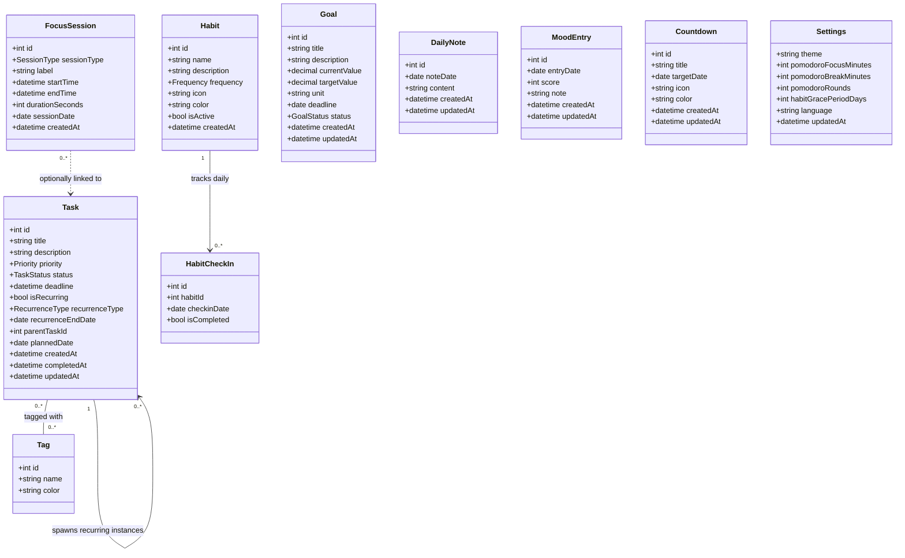

# 05 - Domain Model

## 1. Tổng quan

Domain Model mô tả các thực thể nghiệp vụ cốt lõi của LifeBoard, thuộc tính của chúng và mối quan hệ giữa chúng. Đây là nền tảng để thiết kế cơ sở dữ liệu và API.

---

## 2. Sơ đồ Class (Mermaid)

---

## 3. Mô tả Chi tiết Các Thực thể

---

### 3.1 Task (Nhiệm vụ)

Thực thể trung tâm của hệ thống. Mỗi task là một đơn vị công việc mà người dùng cần hoàn thành.

| Thuộc tính | Kiểu | Mô tả |
|-----------|------|-------|
| `id` | INT | Khóa chính, tự tăng |
| `title` | VARCHAR(255) | Tiêu đề nhiệm vụ — bắt buộc |
| `description` | TEXT | Mô tả chi tiết — tùy chọn |
| `priority` | ENUM | `low` / `medium` / `high` |
| `status` | ENUM | `pending` / `in_progress` / `done` / `archived` |
| `deadline` | DATETIME | Hạn chót — tùy chọn |
| `isRecurring` | BOOLEAN | Task có lặp lại không |
| `recurrenceType` | ENUM | `daily` / `weekly` / `monthly` — NULL nếu không lặp |
| `recurrenceEndDate` | DATE | Ngày kết thúc chuỗi lặp — tùy chọn |
| `parentTaskId` | INT (FK) | Trỏ về task gốc nếu là instance của recurring task |
| `plannedDate` | DATE | Ngày task được lên kế hoạch (Tomorrow Planning) |
| `createdAt` | DATETIME | Thời điểm tạo |
| `completedAt` | DATETIME | Thời điểm hoàn thành — NULL nếu chưa xong |
| `updatedAt` | DATETIME | Lần cập nhật cuối |

**Enum Priority:** `low` · `medium` · `high`

**Enum TaskStatus:** `pending` · `in_progress` · `done` · `archived`

**Enum RecurrenceType:** `daily` · `weekly` · `monthly`

**Quy tắc nghiệp vụ:**
- `title` không được rỗng.
- Khi `status = done`, `completedAt` phải được ghi lại.
- Nếu `isRecurring = true`, `recurrenceType` là bắt buộc.
- `parentTaskId` chỉ có giá trị ở các instance được sinh tự động từ chuỗi lặp.
- `plannedDate` được dùng để phân biệt task "hôm nay" và task "ngày mai".

---

### 3.2 Tag (Nhãn)

Nhãn phân loại gắn vào Task. Một task có thể có nhiều tag; một tag có thể gắn vào nhiều task.

| Thuộc tính | Kiểu | Mô tả |
|-----------|------|-------|
| `id` | INT | Khóa chính |
| `name` | VARCHAR(50) | Tên nhãn — duy nhất |
| `color` | VARCHAR(7) | Mã màu HEX (VD: `#4A90E2`) |

**Quy tắc nghiệp vụ:**
- `name` là duy nhất toàn hệ thống.
- Xóa tag → tự động gỡ khỏi tất cả task liên quan.

---

### 3.3 Habit (Thói quen)

Hành vi lặp lại mà người dùng muốn xây dựng và theo dõi.

| Thuộc tính | Kiểu | Mô tả |
|-----------|------|-------|
| `id` | INT | Khóa chính |
| `name` | VARCHAR(255) | Tên thói quen |
| `description` | TEXT | Mô tả — tùy chọn |
| `frequency` | ENUM | `daily` / `weekly` / `monthly` |
| `icon` | VARCHAR(50) | Emoji hoặc icon identifier |
| `color` | VARCHAR(7) | Mã màu HEX |
| `isActive` | BOOLEAN | Đang theo dõi hay đã tạm dừng |
| `createdAt` | DATETIME | Thời điểm tạo |

**Quy tắc nghiệp vụ:**
- Streak được tính toán động từ bảng `HabitCheckIn`, không lưu trực tiếp.
- `isActive = false` → habit bị ẩn khỏi danh sách check-in hàng ngày.

---

### 3.4 HabitCheckIn (Lịch sử Check-in Thói quen)

Ghi nhận mỗi lần người dùng check-in cho một thói quen theo ngày.

| Thuộc tính | Kiểu | Mô tả |
|-----------|------|-------|
| `id` | INT | Khóa chính |
| `habitId` | INT (FK) | Tham chiếu Habit |
| `checkinDate` | DATE | Ngày check-in |
| `isCompleted` | BOOLEAN | Đã hoàn thành trong ngày chưa |

**Ràng buộc:** `UNIQUE (habitId, checkinDate)` — mỗi thói quen chỉ có một bản ghi mỗi ngày.

**Công thức Streak:**
> Đếm số ngày liên tiếp gần nhất có `isCompleted = true`, tính ngược từ hôm nay.

---

### 3.5 FocusSession (Phiên Tập trung)

Ghi nhận một phiên làm việc tập trung bằng Stopwatch hoặc Pomodoro.

| Thuộc tính | Kiểu | Mô tả |
|-----------|------|-------|
| `id` | INT | Khóa chính |
| `sessionType` | ENUM | `stopwatch` / `pomodoro` |
| `label` | VARCHAR(255) | Nhãn tùy chọn (tên task/chủ đề) |
| `startTime` | DATETIME | Thời điểm bắt đầu |
| `endTime` | DATETIME | Thời điểm kết thúc |
| `durationSeconds` | INT | Tổng thời gian (giây) |
| `sessionDate` | DATE | Ngày của phiên (denormalized để truy vấn nhanh) |
| `createdAt` | DATETIME | Thời điểm ghi lại |

**Quy tắc nghiệp vụ:**
- `durationSeconds = TIMESTAMPDIFF(SECOND, startTime, endTime)`
- `sessionDate` được tính từ `startTime` khi lưu.
- Phiên Pomodoro: mỗi vòng focus hoàn chỉnh tạo một `FocusSession`.

---

### 3.6 Goal (Mục tiêu Dài hạn)

Mục tiêu định lượng với tiến độ theo dõi theo thời gian.

| Thuộc tính | Kiểu | Mô tả |
|-----------|------|-------|
| `id` | INT | Khóa chính |
| `title` | VARCHAR(255) | Tiêu đề mục tiêu |
| `description` | TEXT | Mô tả — tùy chọn |
| `currentValue` | DECIMAL(10,2) | Giá trị hiện tại |
| `targetValue` | DECIMAL(10,2) | Giá trị mục tiêu |
| `unit` | VARCHAR(50) | Đơn vị (VD: km, cuốn sách, %) |
| `deadline` | DATE | Hạn chót — tùy chọn |
| `status` | ENUM | `active` / `completed` / `paused` |
| `createdAt` | DATETIME | Thời điểm tạo |
| `updatedAt` | DATETIME | Lần cập nhật cuối |

**Công thức progress:** `progressPercent = (currentValue / targetValue) * 100`

**Quy tắc nghiệp vụ:**
- Khi `currentValue >= targetValue` → `status` tự động chuyển sang `completed`.

---

### 3.7 DailyNote (Ghi chú Ngày)

Ghi chú Markdown gắn với một ngày cụ thể. Mỗi ngày chỉ có một ghi chú.

| Thuộc tính | Kiểu | Mô tả |
|-----------|------|-------|
| `id` | INT | Khóa chính |
| `noteDate` | DATE | Ngày gắn với ghi chú — UNIQUE |
| `content` | LONGTEXT | Nội dung Markdown |
| `createdAt` | DATETIME | Thời điểm tạo |
| `updatedAt` | DATETIME | Lần cập nhật cuối |

---

### 3.8 MoodEntry (Tâm trạng)

Ghi nhận tâm trạng người dùng một lần mỗi ngày.

| Thuộc tính | Kiểu | Mô tả |
|-----------|------|-------|
| `id` | INT | Khóa chính |
| `entryDate` | DATE | Ngày ghi — UNIQUE |
| `score` | TINYINT | Điểm tâm trạng: 1 (rất tệ) → 5 (rất tốt) |
| `note` | VARCHAR(500) | Ghi chú ngắn — tùy chọn |
| `createdAt` | DATETIME | Thời điểm tạo |
| `updatedAt` | DATETIME | Lần cập nhật cuối |

---

### 3.9 Countdown (Đếm ngược Sự kiện)

Sự kiện quan trọng mà người dùng muốn đếm ngược đến.

| Thuộc tính | Kiểu | Mô tả |
|-----------|------|-------|
| `id` | INT | Khóa chính |
| `title` | VARCHAR(255) | Tên sự kiện |
| `targetDate` | DATE | Ngày mục tiêu |
| `icon` | VARCHAR(50) | Emoji hoặc icon — tùy chọn |
| `color` | VARCHAR(7) | Mã màu HEX — tùy chọn |
| `createdAt` | DATETIME | Thời điểm tạo |
| `updatedAt` | DATETIME | Lần cập nhật cuối |

**Công thức daysRemaining:** `DATEDIFF(targetDate, CURDATE())`
- > 0: còn X ngày
- = 0: hôm nay
- < 0: đã qua X ngày

---

### 3.10 Settings (Cài đặt)

Bảng singleton lưu toàn bộ cài đặt ứng dụng (luôn có đúng 1 bản ghi).

| Thuộc tính | Kiểu | Mô tả |
|-----------|------|-------|
| `theme` | ENUM | `light` / `dark` — mặc định `dark` |
| `pomodoroFocusMinutes` | INT | Thời gian focus (phút) — mặc định 25 |
| `pomodoroBreakMinutes` | INT | Thời gian nghỉ (phút) — mặc định 5 |
| `pomodoroRounds` | INT | Số vòng mỗi session — mặc định 4 |
| `habitGracePeriodDays` | INT | Số ngày cho phép bỏ lỡ trước khi reset streak — mặc định 0 |
| `language` | VARCHAR(10) | Ngôn ngữ giao diện — mặc định `vi` |
| `updatedAt` | DATETIME | Lần cập nhật cuối |

---

## 4. Quan hệ Giữa Các Thực thể

| Từ | Quan hệ | Đến | Ghi chú |
|----|---------|-----|---------|
| Task | M:N | Tag | Qua bảng trung gian `task_tags` |
| Task | 1:N | Task | Task gốc sinh ra nhiều instances (recurring) |
| Habit | 1:N | HabitCheckIn | Một thói quen có nhiều bản ghi check-in |
| FocusSession | N:1 | Task | Phiên tập trung có thể gắn nhãn task (tùy chọn) |
| DailyNote | — | — | Độc lập, khóa theo `noteDate` |
| MoodEntry | — | — | Độc lập, khóa theo `entryDate` |
| Countdown | — | — | Độc lập |
| Goal | — | — | Độc lập |
| Settings | — | — | Singleton |

---

## 5. Glossary (Thuật ngữ Domain)

| Thuật ngữ | Định nghĩa |
|-----------|-----------|
| **Task** | Đơn vị công việc cần thực hiện, có trạng thái và thời hạn |
| **Streak** | Chuỗi ngày liên tiếp hoàn thành một thói quen |
| **Focus Session** | Khoảng thời gian làm việc tập trung có đo lường |
| **Planned Date** | Ngày người dùng dự kiến thực hiện task (Tomorrow Planning) |
| **Recurring Task** | Task được tự động tạo lại theo chu kỳ cài sẵn |
| **Daily Detail** | Tổng hợp toàn bộ hoạt động trong một ngày cụ thể |
| **Heatmap** | Bản đồ nhiệt thể hiện cường độ hoạt động theo ngày |
| **Grace Period** | Số ngày cho phép bỏ lỡ mà không reset streak |
