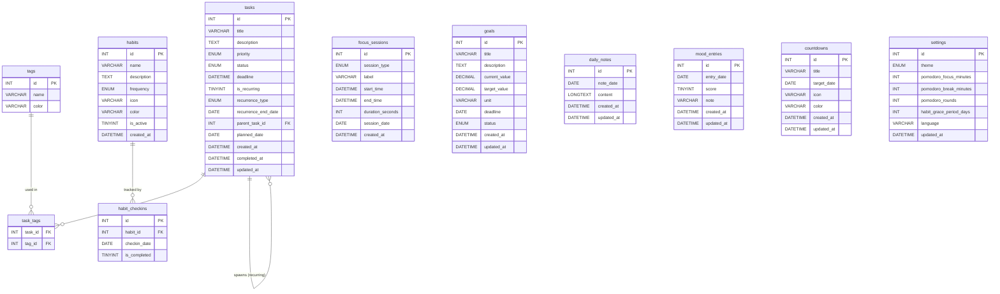

# 07 - ERD & Database Design

**Database:** MySQL 8.0+
**Charset:** `utf8mb4`
**Collation:** `utf8mb4_unicode_ci`

---

## 1. Entity Relationship Diagram (Mermaid)



---

## 2. Schema Chi tiết

---

### 2.1 Bảng `tasks`

```sql
CREATE TABLE tasks (
    id                  INT             NOT NULL AUTO_INCREMENT,
    title               VARCHAR(255)    NOT NULL,
    description         TEXT            NULL,
    priority            ENUM('low','medium','high')
                                        NOT NULL DEFAULT 'medium',
    status              ENUM('pending','in_progress','done','archived')
                                        NOT NULL DEFAULT 'pending',
    deadline            DATETIME        NULL,
    is_recurring        TINYINT(1)      NOT NULL DEFAULT 0,
    recurrence_type     ENUM('daily','weekly','monthly')
                                        NULL,
    recurrence_end_date DATE            NULL,
    parent_task_id      INT             NULL,
    planned_date        DATE            NULL,
    created_at          DATETIME        NOT NULL DEFAULT CURRENT_TIMESTAMP,
    completed_at        DATETIME        NULL,
    updated_at          DATETIME        NOT NULL DEFAULT CURRENT_TIMESTAMP
                                        ON UPDATE CURRENT_TIMESTAMP,

    PRIMARY KEY (id),
    CONSTRAINT fk_task_parent
        FOREIGN KEY (parent_task_id) REFERENCES tasks(id)
        ON DELETE SET NULL,

    INDEX idx_tasks_status      (status),
    INDEX idx_tasks_planned_date (planned_date),
    INDEX idx_tasks_deadline    (deadline),
    INDEX idx_tasks_parent      (parent_task_id)
) ENGINE=InnoDB DEFAULT CHARSET=utf8mb4 COLLATE=utf8mb4_unicode_ci;
```

**Ghi chú:**
- `is_recurring = 1` yêu cầu `recurrence_type` phải có giá trị.
- `parent_task_id` chỉ có giá trị ở các instance được tạo tự động.
- `planned_date` phân biệt task "hôm nay" và "ngày mai" trong Tomorrow Planning.

---

### 2.2 Bảng `tags`

```sql
CREATE TABLE tags (
    id      INT         NOT NULL AUTO_INCREMENT,
    name    VARCHAR(50) NOT NULL,
    color   VARCHAR(7)  NOT NULL DEFAULT '#6B7280',

    PRIMARY KEY (id),
    UNIQUE KEY uq_tags_name (name)
) ENGINE=InnoDB DEFAULT CHARSET=utf8mb4 COLLATE=utf8mb4_unicode_ci;
```

---

### 2.3 Bảng `task_tags` (Junction)

```sql
CREATE TABLE task_tags (
    task_id INT NOT NULL,
    tag_id  INT NOT NULL,

    PRIMARY KEY (task_id, tag_id),
    CONSTRAINT fk_tt_task
        FOREIGN KEY (task_id) REFERENCES tasks(id)
        ON DELETE CASCADE,
    CONSTRAINT fk_tt_tag
        FOREIGN KEY (tag_id) REFERENCES tags(id)
        ON DELETE CASCADE
) ENGINE=InnoDB DEFAULT CHARSET=utf8mb4 COLLATE=utf8mb4_unicode_ci;
```

---

### 2.4 Bảng `habits`

```sql
CREATE TABLE habits (
    id          INT             NOT NULL AUTO_INCREMENT,
    name        VARCHAR(255)    NOT NULL,
    description TEXT            NULL,
    frequency   ENUM('daily','weekly','monthly')
                                NOT NULL DEFAULT 'daily',
    icon        VARCHAR(50)     NULL,
    color       VARCHAR(7)      NOT NULL DEFAULT '#6B7280',
    is_active   TINYINT(1)      NOT NULL DEFAULT 1,
    created_at  DATETIME        NOT NULL DEFAULT CURRENT_TIMESTAMP,

    PRIMARY KEY (id),
    INDEX idx_habits_active (is_active)
) ENGINE=InnoDB DEFAULT CHARSET=utf8mb4 COLLATE=utf8mb4_unicode_ci;
```

---

### 2.5 Bảng `habit_checkins`

```sql
CREATE TABLE habit_checkins (
    id           INT        NOT NULL AUTO_INCREMENT,
    habit_id     INT        NOT NULL,
    checkin_date DATE       NOT NULL,
    is_completed TINYINT(1) NOT NULL DEFAULT 0,

    PRIMARY KEY (id),
    UNIQUE KEY uq_habit_date (habit_id, checkin_date),
    CONSTRAINT fk_hc_habit
        FOREIGN KEY (habit_id) REFERENCES habits(id)
        ON DELETE CASCADE,

    INDEX idx_hc_date (checkin_date)
) ENGINE=InnoDB DEFAULT CHARSET=utf8mb4 COLLATE=utf8mb4_unicode_ci;
```

**Ghi chú:**
- Streak được tính động bằng truy vấn, không lưu column riêng.
- `UNIQUE (habit_id, checkin_date)` đảm bảo mỗi thói quen chỉ check-in 1 lần/ngày.

---

### 2.6 Bảng `focus_sessions`

```sql
CREATE TABLE focus_sessions (
    id               INT          NOT NULL AUTO_INCREMENT,
    session_type     ENUM('stopwatch','pomodoro')
                                  NOT NULL,
    label            VARCHAR(255) NULL,
    start_time       DATETIME     NOT NULL,
    end_time         DATETIME     NOT NULL,
    duration_seconds INT          NOT NULL,
    session_date     DATE         NOT NULL,
    created_at       DATETIME     NOT NULL DEFAULT CURRENT_TIMESTAMP,

    PRIMARY KEY (id),
    INDEX idx_fs_session_date (session_date),
    INDEX idx_fs_type         (session_type)
) ENGINE=InnoDB DEFAULT CHARSET=utf8mb4 COLLATE=utf8mb4_unicode_ci;
```

**Ghi chú:**
- `duration_seconds` = `TIMESTAMPDIFF(SECOND, start_time, end_time)` — lưu sẵn để truy vấn nhanh.
- `session_date` = DATE(start_time) — denormalized để group by ngày hiệu quả.

---

### 2.7 Bảng `goals`

```sql
CREATE TABLE goals (
    id            INT             NOT NULL AUTO_INCREMENT,
    title         VARCHAR(255)    NOT NULL,
    description   TEXT            NULL,
    current_value DECIMAL(10,2)   NOT NULL DEFAULT 0.00,
    target_value  DECIMAL(10,2)   NOT NULL,
    unit          VARCHAR(50)     NOT NULL,
    deadline      DATE            NULL,
    status        ENUM('active','completed','paused')
                                  NOT NULL DEFAULT 'active',
    created_at    DATETIME        NOT NULL DEFAULT CURRENT_TIMESTAMP,
    updated_at    DATETIME        NOT NULL DEFAULT CURRENT_TIMESTAMP
                                  ON UPDATE CURRENT_TIMESTAMP,

    PRIMARY KEY (id),
    INDEX idx_goals_status (status)
) ENGINE=InnoDB DEFAULT CHARSET=utf8mb4 COLLATE=utf8mb4_unicode_ci;
```

---

### 2.8 Bảng `daily_notes`

```sql
CREATE TABLE daily_notes (
    id         INT      NOT NULL AUTO_INCREMENT,
    note_date  DATE     NOT NULL,
    content    LONGTEXT NULL,
    created_at DATETIME NOT NULL DEFAULT CURRENT_TIMESTAMP,
    updated_at DATETIME NOT NULL DEFAULT CURRENT_TIMESTAMP
                        ON UPDATE CURRENT_TIMESTAMP,

    PRIMARY KEY (id),
    UNIQUE KEY uq_daily_notes_date (note_date)
) ENGINE=InnoDB DEFAULT CHARSET=utf8mb4 COLLATE=utf8mb4_unicode_ci;
```

---

### 2.9 Bảng `mood_entries`

```sql
CREATE TABLE mood_entries (
    id         INT          NOT NULL AUTO_INCREMENT,
    entry_date DATE         NOT NULL,
    score      TINYINT      NOT NULL,
    note       VARCHAR(500) NULL,
    created_at DATETIME     NOT NULL DEFAULT CURRENT_TIMESTAMP,
    updated_at DATETIME     NOT NULL DEFAULT CURRENT_TIMESTAMP
                            ON UPDATE CURRENT_TIMESTAMP,

    PRIMARY KEY (id),
    UNIQUE KEY uq_mood_date (entry_date),

    CONSTRAINT chk_mood_score CHECK (score BETWEEN 1 AND 5)
) ENGINE=InnoDB DEFAULT CHARSET=utf8mb4 COLLATE=utf8mb4_unicode_ci;
```

---

### 2.10 Bảng `countdowns`

```sql
CREATE TABLE countdowns (
    id          INT          NOT NULL AUTO_INCREMENT,
    title       VARCHAR(255) NOT NULL,
    target_date DATE         NOT NULL,
    icon        VARCHAR(50)  NULL,
    color       VARCHAR(7)   NULL DEFAULT '#6B7280',
    created_at  DATETIME     NOT NULL DEFAULT CURRENT_TIMESTAMP,
    updated_at  DATETIME     NOT NULL DEFAULT CURRENT_TIMESTAMP
                             ON UPDATE CURRENT_TIMESTAMP,

    PRIMARY KEY (id),
    INDEX idx_countdowns_date (target_date)
) ENGINE=InnoDB DEFAULT CHARSET=utf8mb4 COLLATE=utf8mb4_unicode_ci;
```

---

### 2.11 Bảng `settings`

```sql
CREATE TABLE settings (
    id                     INT         NOT NULL AUTO_INCREMENT,
    theme                  ENUM('light','dark')
                                       NOT NULL DEFAULT 'dark',
    pomodoro_focus_minutes INT         NOT NULL DEFAULT 25,
    pomodoro_break_minutes INT         NOT NULL DEFAULT 5,
    pomodoro_rounds        INT         NOT NULL DEFAULT 4,
    habit_grace_period_days INT        NOT NULL DEFAULT 0,
    language               VARCHAR(10) NOT NULL DEFAULT 'vi',
    updated_at             DATETIME    NOT NULL DEFAULT CURRENT_TIMESTAMP
                                       ON UPDATE CURRENT_TIMESTAMP,

    PRIMARY KEY (id)
) ENGINE=InnoDB DEFAULT CHARSET=utf8mb4 COLLATE=utf8mb4_unicode_ci;

-- Seed bản ghi mặc định (singleton)
INSERT INTO settings (id, theme, pomodoro_focus_minutes, pomodoro_break_minutes,
                      pomodoro_rounds, habit_grace_period_days, language)
VALUES (1, 'dark', 25, 5, 4, 0, 'vi');
```

---

## 3. Quan hệ & Ràng buộc

| Bảng con | FK Column | Bảng cha | ON DELETE |
|----------|-----------|----------|-----------|
| `tasks` | `parent_task_id` | `tasks` | SET NULL |
| `task_tags` | `task_id` | `tasks` | CASCADE |
| `task_tags` | `tag_id` | `tags` | CASCADE |
| `habit_checkins` | `habit_id` | `habits` | CASCADE |

---

## 4. Indexes Tổng hợp

| Bảng | Index | Columns | Mục đích |
|------|-------|---------|---------|
| `tasks` | `idx_tasks_status` | `status` | Lọc task theo trạng thái |
| `tasks` | `idx_tasks_planned_date` | `planned_date` | Tomorrow Planning query |
| `tasks` | `idx_tasks_deadline` | `deadline` | Sắp xếp/cảnh báo deadline |
| `tasks` | `idx_tasks_parent` | `parent_task_id` | Tìm instances của recurring task |
| `habit_checkins` | `idx_hc_date` | `checkin_date` | Query check-in theo ngày |
| `focus_sessions` | `idx_fs_session_date` | `session_date` | Tổng hợp focus theo ngày |
| `focus_sessions` | `idx_fs_type` | `session_type` | Lọc theo loại phiên |
| `countdowns` | `idx_countdowns_date` | `target_date` | Sắp xếp countdown |
| `habits` | `idx_habits_active` | `is_active` | Lọc habit đang theo dõi |

---

## 5. Các Truy vấn Quan trọng

### Q-01: Dashboard — Tasks hôm nay

```sql
SELECT t.*, GROUP_CONCAT(tg.name) AS tags
FROM tasks t
LEFT JOIN task_tags tt ON tt.task_id = t.id
LEFT JOIN tags tg ON tg.id = tt.tag_id
WHERE (t.planned_date = CURDATE() OR (t.planned_date IS NULL AND DATE(t.created_at) = CURDATE()))
  AND t.status != 'archived'
GROUP BY t.id
ORDER BY
    FIELD(t.priority, 'high', 'medium', 'low'),
    t.deadline ASC;
```

---

### Q-02: Tính Streak của một Thói quen

```sql
-- Đếm số ngày liên tiếp có is_completed = 1 tính từ hôm nay ngược lại
SELECT COUNT(*) AS streak
FROM (
    SELECT checkin_date,
           ROW_NUMBER() OVER (ORDER BY checkin_date DESC) AS rn,
           DATEDIFF(CURDATE(), checkin_date) AS days_ago
    FROM habit_checkins
    WHERE habit_id = ? AND is_completed = 1
) sub
WHERE days_ago = rn - 1;
```

---

### Q-03: Yearly Heatmap — Tổng hoạt động theo ngày

```sql
SELECT
    activity_date,
    SUM(task_count)    AS task_count,
    SUM(focus_minutes) AS focus_minutes,
    SUM(habit_done)    AS habit_done
FROM (
    -- Tasks hoàn thành
    SELECT DATE(completed_at) AS activity_date,
           COUNT(*) AS task_count, 0 AS focus_minutes, 0 AS habit_done
    FROM tasks
    WHERE YEAR(completed_at) = ?
      AND status = 'done'
    GROUP BY DATE(completed_at)

    UNION ALL

    -- Focus sessions
    SELECT session_date AS activity_date,
           0, SUM(duration_seconds) / 60, 0
    FROM focus_sessions
    WHERE YEAR(session_date) = ?
    GROUP BY session_date

    UNION ALL

    -- Habit check-ins
    SELECT checkin_date AS activity_date,
           0, 0, COUNT(*)
    FROM habit_checkins
    WHERE YEAR(checkin_date) = ? AND is_completed = 1
    GROUP BY checkin_date
) combined
GROUP BY activity_date
ORDER BY activity_date;
```

---

### Q-04: Weekly Statistics

```sql
SELECT
    DATE(completed_at)                      AS day,
    COUNT(*)                                AS completed_tasks,
    (SELECT SUM(duration_seconds)/60
     FROM focus_sessions
     WHERE session_date = DATE(t.completed_at)) AS focus_minutes
FROM tasks t
WHERE completed_at >= DATE_SUB(CURDATE(), INTERVAL 7 DAY)
  AND status = 'done'
GROUP BY DATE(completed_at)
ORDER BY day;
```

---

### Q-05: Countdown — Ngày còn lại

```sql
SELECT
    id,
    title,
    target_date,
    DATEDIFF(target_date, CURDATE()) AS days_remaining,
    icon,
    color
FROM countdowns
ORDER BY ABS(DATEDIFF(target_date, CURDATE())) ASC;
```

---

### Q-06: Search toàn cục

```sql
-- Tasks
SELECT 'task' AS type, id, title AS label, NULL AS content_preview
FROM tasks
WHERE (title LIKE CONCAT('%', ?, '%') OR description LIKE CONCAT('%', ?, '%'))
  AND status != 'archived'

UNION ALL

-- Daily Notes
SELECT 'note' AS type, id, DATE_FORMAT(note_date, '%d/%m/%Y') AS label,
       LEFT(content, 100) AS content_preview
FROM daily_notes
WHERE content LIKE CONCAT('%', ?, '%')

UNION ALL

-- Habits
SELECT 'habit' AS type, id, name AS label, NULL
FROM habits
WHERE name LIKE CONCAT('%', ?, '%')

UNION ALL

-- Goals
SELECT 'goal' AS type, id, title AS label, NULL
FROM goals
WHERE title LIKE CONCAT('%', ?, '%')

LIMIT 50;
```

---

## 6. Migration Script (Khởi tạo)

```sql
-- Chạy theo thứ tự này để tránh lỗi FK

CREATE DATABASE IF NOT EXISTS lifeboard
    CHARACTER SET utf8mb4
    COLLATE utf8mb4_unicode_ci;

USE lifeboard;

-- 1. tasks (tự tham chiếu, tạo trước)
-- 2. tags
-- 3. task_tags
-- 4. habits
-- 5. habit_checkins
-- 6. focus_sessions
-- 7. goals
-- 8. daily_notes
-- 9. mood_entries
-- 10. countdowns
-- 11. settings + INSERT seed
```

---

## 7. Tóm tắt Bảng

| # | Bảng | Dòng mẫu | Mục đích |
|---|------|---------|---------|
| 1 | `tasks` | Nhiều | Nhiệm vụ cá nhân |
| 2 | `tags` | Ít | Nhãn phân loại |
| 3 | `task_tags` | Nhiều | Gắn tag vào task (M:N) |
| 4 | `habits` | Vừa | Định nghĩa thói quen |
| 5 | `habit_checkins` | Nhiều | Lịch sử check-in hàng ngày |
| 6 | `focus_sessions` | Nhiều | Phiên tập trung |
| 7 | `goals` | Ít-Vừa | Mục tiêu dài hạn |
| 8 | `daily_notes` | Vừa | Ghi chú Markdown theo ngày |
| 9 | `mood_entries` | Vừa | Tâm trạng hàng ngày |
| 10 | `countdowns` | Ít | Sự kiện đếm ngược |
| 11 | `settings` | 1 (singleton) | Cài đặt ứng dụng |
