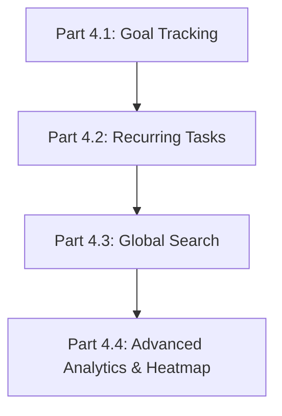

# Stage 4: Advanced Features & Full Analytics — Detailed Breakdown

Document này chia nhỏ **Stage 4** (giai đoạn tính năng nâng cao & thống kê chuyên sâu) từ `timeline.md` thành **4 phần phát triển nhỏ (Sub-Stages)**. Việc chia nhỏ giúp kiểm soát chất lượng, dễ dàng kiểm thử (testing), và tiến hành từng bước một cách bài bản mà không bị quá tải.

---

## 🗺️ Tổng quan phân chia Stage 4

| Sub-Stage | Tên giai đoạn | Mục tiêu chính | Phân hệ chính |
| --- | --- | --- | --- |
| **Part 4.1** | **Goal Tracking (Mục tiêu)** | Quản lý mục tiêu dài hạn & tiến độ | Backend API + Goal Tracker UI |
| **Part 4.2** | **Recurring Tasks (Tác vụ lặp)** | Tự động hóa sinh task lặp lại | Background Service + Task Recurrence UI |
| **Part 4.3** | **Global Search (Tìm kiếm)** | Tìm kiếm toàn cục đa thực thể | Search Engine API + Command Palette UI |
| **Part 4.4** | **Advanced Analytics & Heatmap** | Thống kê chuyên sâu & GitHub Heatmap | Aggregation APIs + Heatmap & Charts UI |

---

## 🎯 Chi tiết từng phần (Sub-Stage Breakdown)

### 📌 Part 4.1: Goal Tracking System (Quản lý Mục tiêu Dài hạn)

**Mục tiêu:** Giúp người dùng thiết lập các mục tiêu theo mốc (Ví dụ: "Đọc 12 cuốn sách", "Tích lũy 100 giờ học"), cập nhật tiến độ liên tục và theo dõi phần trăm hoàn thành.

#### 1. Backend (C# ASP.NET Core & MySQL):
- [ ] **Data Model & Entity**: Rà soát `GoalEntity`, `GoalDto`, `CreateGoalDto`.
- [ ] **Repository Layer**: Hoàn thiện `GoalRepository` (CRUD goals, cập nhật `current_value` & `status`).
- [ ] **Service Layer**: Hoàn thiện `GoalService` (tính toán `progressPercent`, tự động chuyển status sang `completed` khi `currentValue >= targetValue`).
- [ ] **Controller Layer**: Hoàn thiện `GoalsController` (`GET /goals`, `POST /goals`, `PUT /goals/{id}`, `PATCH /goals/{id}/progress`, `DELETE /goals/{id}`).

#### 2. Frontend (React + TypeScript):
- [ ] **Goal Tracker Page (`GoalsPage.tsx`)**:
  - Filter mục tiêu theo trạng thái: Đang làm (Active), Đã xong (Completed), Tạm dừng (Paused).
  - Thẻ Goal Card hiển thị thanh tiến độ (Progress Bar), đơn vị (`unit`), mốc `current/target`, và deadline.
- [ ] **Modals**:
  - Modal tạo/chỉnh sửa mục tiêu (`GoalFormModal.tsx`).
  - Modal cập nhật nhanh tiến độ (`UpdateProgressModal.tsx`).

#### 3. Definition of Done (DoD):
- Tạo, sửa, xóa mục tiêu thành công.
- Cập nhật tiến độ chính xác, progress bar phản hồi mượt mà.
- Khi đạt đủ target, status tự động chuyển thành hoàn thành kèm hiệu ứng ăn mừng.

---

### 📌 Part 4.2: Recurring Tasks Automation (Nhiệm vụ Lặp lại Tự động)

**Mục tiêu:** Tự động tạo nhiệm vụ lặp lại (Hàng ngày, Hàng tuần, Hàng tháng) mà không cần người dùng tạo thủ công mỗi ngày.

#### 1. Backend (C# ASP.NET Core & MySQL):
- [ ] **Background Service (`DailyTaskScheduler.cs`)**:
  - Triển khai `IHostedService` / `BackgroundService` chạy ngầm trong ứng dụng.
  - Cấu hình kích hoạt vào 00:00:00 mỗi ngày (hoặc kiểm tra định kỳ mỗi 1 tiếng).
- [ ] **Recurring Task Logic**:
  - Tìm tất cả các task có `is_recurring = 1` và chưa quá `recurrence_end_date`.
  - Kiểm tra xem task của chu kỳ tiếp theo đã tồn tại chưa (tránh tạo trùng lặp).
  - Tự động bản sao task mới với `planned_date` tương ứng.

#### 2. Frontend (React + TypeScript):
- [ ] **Task Form Modal (`TaskFormModal.tsx`)**:
  - Bổ sung tùy chọn toggle "Nhiệm vụ lặp lại".
  - Chọn tần suất (Hàng ngày `daily`, Hàng tuần `weekly`, Hàng tháng `monthly`).
  - Chọn ngày kết thúc lặp `recurrenceEndDate` (tùy chọn).
- [ ] **Task Card Display**:
  - Bổ sung biểu tượng badge lặp lại (🔄 `Daily`, 🔄 `Weekly`) trên thẻ Task Card ở `TasksPage` và `DashboardPage`.

#### 3. Definition of Done (DoD):
- Background service hoạt động ổn định, không làm chậm ứng dụng.
- Tự động sinh ra task mới vào ngày mới mà không tạo trùng.
- Người dùng cấu hình được chu kỳ lặp và ngày hết hạn lặp trên UI.

---

### 📌 Part 4.3: Global Search System (Tìm kiếm Toàn cục)

**Mục tiêu:** Cho phép người dùng tra cứu nhanh bất kỳ dữ liệu nào (Nhiệm vụ, Ghi chú, Thói quen, Mục tiêu) chỉ qua một thanh tìm kiếm hoặc tổ hợp phím tắt.

#### 1. Backend (C# ASP.NET Core & MySQL):
- [ ] **Search DTOs**: Xây dựng `SearchResultsDto` chứa kết quả tổng hợp phân loại theo Task, Notes, Habits, Goals.
- [ ] **Search Repository & Service**:
  - Viết truy vấn tìm kiếm `LIKE %query%` hoặc Full-text search trên các bảng `tasks`, `daily_notes`, `habits`, `goals`.
- [ ] **Search Controller (`SearchController.cs`)**:
  - Endpoint `GET /search?q={query}` trả về kết quả cấu trúc gọn nhẹ.

#### 2. Frontend (React + TypeScript):
- [ ] **Global Search Modal / Command Palette (`SearchModal.tsx`)**:
  - Kích hoạt bằng tổ hợp phím tắt `Ctrl + K` (hoặc `Cmd + K`) hoặc nhấn icon Tìm kiếm trên Header.
  - Ô nhập từ khóa với hiệu ứng Debounce (300ms).
  - Hiển thị danh sách kết quả nhóm theo phân loại (Nhiệm vụ, Ghi chú, Thói quen, Mục tiêu).
- [ ] **Quick Navigation**: Nhấp vào kết quả sẽ chuyển hướng ngay đến trang hoặc mở modal chi tiết tương ứng.

#### 3. Definition of Done (DoD):
- Phím tắt `Ctrl + K` mở modal nhanh chóng.
- Phản hồi kết quả mượt mà (< 200ms).
- Tìm đúng từ khóa tiếng Việt có dấu & không dấu.

---

### 📌 Part 4.4: Advanced Analytics & Yearly Heatmap (Thống kê Chuyên sâu)

**Mục tiêu:** Cung cấp cho người dùng bức tranh tổng thể về năng suất cá nhân thông qua biểu đồ theo tháng, biểu đồ Heatmap 365 ngày (phong cách GitHub) và phân tích tương quan.

#### 1. Backend (C# ASP.NET Core & MySQL):
- [ ] **Analytics Aggregation APIs (`AnalyticsController.cs`)**:
  - `GET /analytics/monthly?year=2026&month=7`: Tổng hợp chỉ số task, focus time, habit completion theo từng ngày trong tháng.
  - `GET /analytics/heatmap?year=2026`: Trả về mảng 365 ngày với mức độ tích cực (Intensity level 0 đến 4) dựa trên tổng nhiệm vụ + phút tập trung.
  - `GET /analytics/summary`: Thống kê tổng số giờ focus, tỉ lệ hoàn thành thói quen, mức độ tâm trạng trung bình.

#### 2. Frontend (React + TypeScript):
- [ ] **Monthly Dashboard Page (`MonthlyPage.tsx`)**:
  - Biểu đồ cột/miền theo dõi xu hướng hoàn thành công việc và thời gian tập trung trong tháng.
- [ ] **Yearly Contribution Heatmap Page (`YearlyPage.tsx`)**:
  - Vẽ ô vuông 52 tuần x 7 ngày phong cách GitHub Heatmap.
  - Tô màu 5 cấp độ (xanh lá hoặc tím neon): Level 0 (xám mờ) → Level 4 (sáng đậm).
  - Hover hiển thị tooltip chi tiết số task & phút tập trung của ngày đó.
- [ ] **Analytics Overview & Reports (`AnalyticsPage.tsx`)**:
  - Thống kê phân bổ theo tag, biểu đồ tương quan tâm trạng và năng suất.

#### 3. Definition of Done (DoD):
- Heatmap vẽ chính xác 365 ngày của năm, màu sắc chuẩn theo dữ liệu thực tế.
- Các biểu đồ mượt mà, responsive tốt trên màn hình nhỏ.
- Dữ liệu aggregation từ backend chính xác 100%.

---

## 🗓️ Lộ trình đề xuất thực hiện (Recommended Sequence)

1. **Tuần 1 / Sprint 3A**: Tập trung làm **Part 4.1 (Goal Tracking)** - hoàn thiện module quản lý mục tiêu.
2. **Tuần 2 / Sprint 3B**: Làm **Part 4.2 (Recurring Tasks)** - tự động hóa task lặp lại.
3. **Tuần 3 / Sprint 3C**: Làm **Part 4.3 (Global Search)** - tìm kiếm toàn cục & Command Palette.
4. **Tuần 4 / Sprint 3D**: Làm **Part 4.4 (Advanced Analytics & Heatmap)** - đóng gói toàn bộ hệ thống báo cáo & heatmap.
